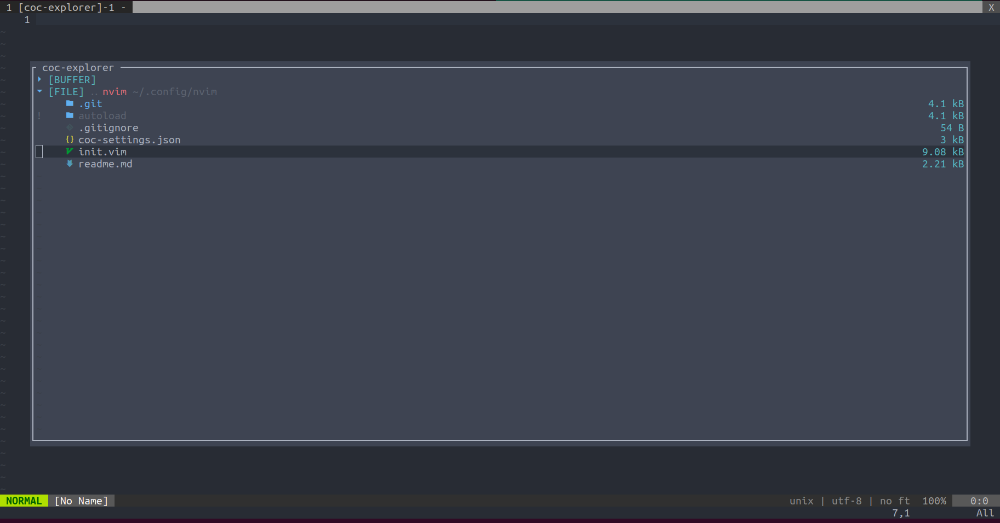
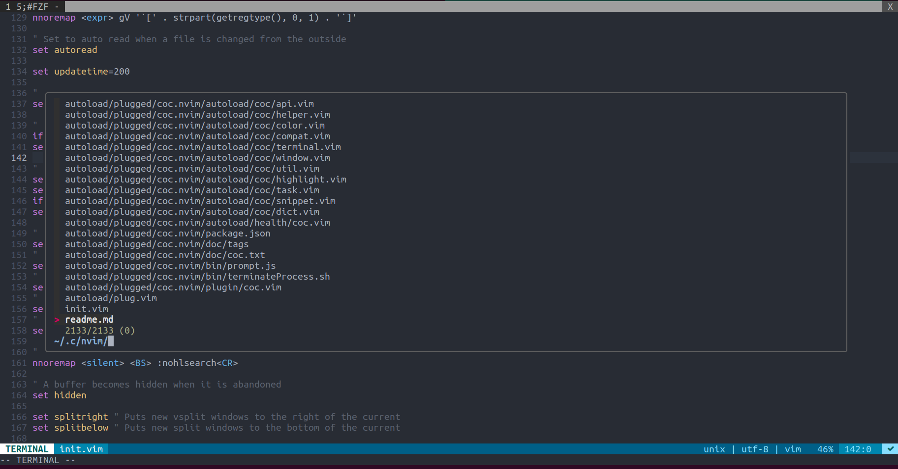
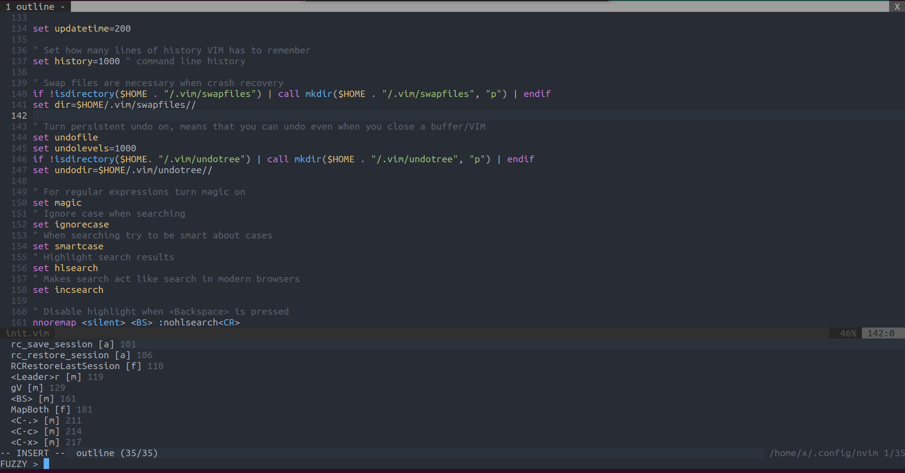

# ngosangns-vim-configure

## Plugins
```
Plug 'joshdick/onedark.vim'
Plug 'itchyny/lightline.vim'
Plug 'dense-analysis/ale'
Plug 'maximbaz/lightline-ale'
Plug 'airblade/vim-gitgutter'
Plug 'tpope/vim-fugitive'
Plug 'tpope/vim-commentary'
Plug 'tpope/vim-surround'
Plug 'ryanoasis/vim-devicons'
Plug 'junegunn/fzf', { 'do': { -> fzf#install() } }
Plug 'neoclide/coc.nvim', {'branch': 'release'}
Plug 'kyazdani42/nvim-web-devicons'
```

## Setup
**Required: NeoVim**
```
sudo apt-get install neovim
```

Open Terminal and run following commands (these commands will make you lost all your current config of Vim!):
```
# Remove old config
sudo rm -rf ~/.config/nvim
# Clone configs from repo to config path of Vim
git clone https://github.com/ngosangns/ngosangns-vim-configure ~/.config/nvim
# Install c-tags for outline
sudo apt-get install universal-ctags
# Install vim-plug package manager of Vim
curl -fLo ~/.vim/autoload/plug.vim --create-dirs \
    https://raw.githubusercontent.com/junegunn/vim-plug/master/plug.vim
# Install NERD fonts
wget https://github.com/ryanoasis/nerd-fonts/releases/download/v2.1.0/Go-Mono.zip
sudo mkdir /usr/share/fonts/nerdfonts
sudo unzip Go-Mono.zip -d /usr/share/fonts/nerdfonts
rm -rf Go-Mono.zip
fc-cache -fv
```
Open neovim with command: `nvim`.  
Run vim command `:PlugInstall`.  
Restart vim.   
Run vim command `:CocInstall coc-html coc-css coc-json coc-tsserver coc-sourcekit coc-go coc-explorer`

Enjoy!  

## Key mappings (all mode)
Exit vim: `Ctrl + d`  

Text behavior:
- Copy: `Ctrl + c`
- Paste: `Ctrl + v`
- New line: `Alt + Enter`
- Cut: `Ctrl + x`
- Format: `\ + f`
- Undo: `Ctrl + z`
- Redo: `Ctrl + y`
- Select all: `Ctrl + a`
- Backspace: `Backspace`
- Enter: `Enter`
- Comment: `Ctrl + /`

Navigation:
- Fast move: `Ctrl + Arrow`
- Switch tab: `Alt + Left|Right`
- Close tab: `Ctrl + w`
- New tab: `Ctrl + n`
- Go to command mode: `Ctrl + \`
- Go to definition: `F12`

File explorer:
- Toggle file explorer: `Ctrl + b`
- Open file in new tab: `t`

File contents:
- Toggle file outline: `Ctrl + r`
- Find files: `Ctrl + p`
- Search text: `Ctrl + f`
- Save file: `Ctrl + s`

## Install LSP server with `coc`
```
:CocInstall <what-you-want>
# Restart vim
```

## Screenshots
  
  
  
